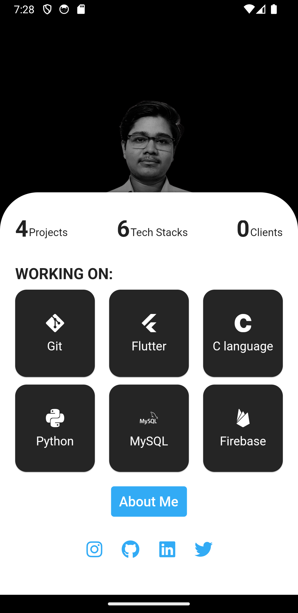

# Portfolio_UI_App
This is a flutter application that describes me and also acts as my standing portfolio.


##  TABLE OF CONTENTS

- [Installation](#installation)
- [Screenshots](#screenshots)
- [Credits](#credits)

## INSTALLATION

```bash
git clone https://AmanKRoy/Portfolio_App.git
cd Portfolio_App
flutter pub get
```

## SCREENSHOTS

### MAIN WINDOW
<table>
  <tr>
    <td style="padding-right: 10;"></td>
    <td style="padding-left: 10;"></td>
  </tr>
  <tr>
    <td>Caption for Screenshot 1</td>
    <td>Caption for Screenshot 2</td>
  </tr>
</table>


 

 


## credits

- [FLUTTER](https://flutter.dev/)
- [DART](https://dart.dev/)
- [VS CODE](https://code.visualstudio.com/)
- [SLIDING SHEET WIDGET](https://pub.dev/packages/sliding_sheet)
- [FONT AWESOME PACKAGE](https://pub.dev/packages/font_awesome_flutter)
